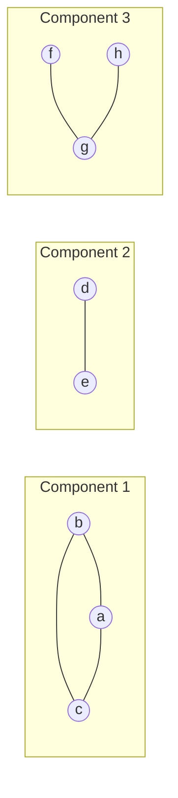

---
tags:
  - bil403
  - graph-theory
  - definition
---

# Connectedness and Components

Related: [[Paths, Circuits and Walks]] · [[Connectivity Measures]] · [[Connectedness in Directed Graphs]]

> [!note] Definition — Connectedness
> An undirected graph is **connected** if there is a path **between every pair of distinct vertices**. Otherwise it is **disconnected**.

> [!note] Definition — Connected component
> A **connected component** of a graph $G$ is a connected subgraph of $G$ that is **not a proper subgraph of another connected subgraph** of $G$. *(I.e. a maximal connected piece.)*
>
> A disconnected graph has two or more disjoint connected components, with $G$ as their union.



## Cut vertex and cut edge

> [!note] Definition — Cut vertex / cut edge
> If removing a **vertex** (and all its incident edges) produces **more connected components**, that vertex is a **cut vertex (articulation point)**.
> Similarly for an **edge**: a **cut edge (bridge)**.

> [!example] Example (from lecture)
> In the given graph, $b, c, e$ → **cut vertices**; $\{a,b\}, \{c,e\}$ → **cut edges**.

> [!note] Definition — Nonseparable graph
> A connected graph with **no cut vertices** is **nonseparable**. Example: $K_n$ (→ [[Special Graphs]]).

> [!tip] Intuition
> Cut vertices/edges = the **fragile points** of a network. If removing one shatters the network, that point is a critical bridge. This is quantified by [[Connectivity Measures]] ($\kappa, \lambda$).

---
> [!tip]- Code (NetworkX)
> ```python
> nx.is_connected(G)
> nx.number_connected_components(G)
> list(nx.connected_components(G))         # each is a set of vertices
> list(nx.articulation_points(G))          # cut vertices
> list(nx.bridges(G))                      # cut edges (bridges)
> ```
