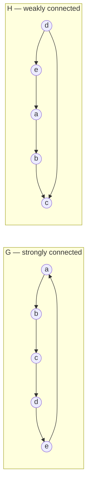

---
tags:
  - bil403
  - graph-theory
  - definition
---

# Connectedness in Directed Graphs

Related: [[Connectedness and Components]] · [[Adjacency and Degree]] · [[Counting Paths]]

In directed graphs there are two distinct notions of "connectedness" — depending on whether or not directions are respected.

> [!note] Definition — Strongly connected
> A directed graph is **strongly connected** if for **every pair $u, v$** there is a path from $v$ to $u$ **and** from $u$ to $v$ (following the edge directions).

> [!note] Definition — Weakly connected
> A directed graph is **weakly connected** if it is **not** strongly connected but its **underlying undirected graph** (when edge directions are forgotten) is connected.


> $G$ is strongly connected. $H$ is not, but forgetting directions it is connected, so it is **weakly connected**.

> [!note] Definition — Strongly connected components
> The subgraphs of a directed graph $G$ that are **strongly connected but not contained in a larger strongly connected subgraph** are the **strongly connected components (strong components)**.

> [!example] Example (from lecture)
> The strong components of $H$: $\{a\},\ \{e\},\ \{b, c, d\}$.

> [!tip] Social/web link
> In the web graph (page → link), strong components are sets of pages reachable "back and forth". In directed social networks (follow), they show closed loops of information flow.

---
> [!tip]- Code (NetworkX)
> ```python
> D = nx.DiGraph(...)
> nx.is_strongly_connected(D)
> nx.is_weakly_connected(D)
> list(nx.strongly_connected_components(D))   # {a}, {e}, {b,c,d} ...
> list(nx.weakly_connected_components(D))
> ```
