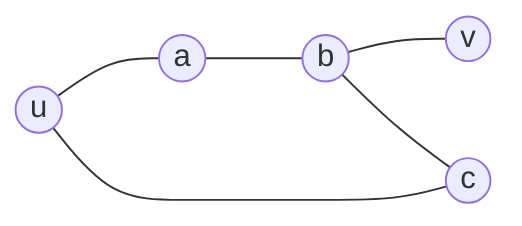

---
tags:
  - bil403
  - graph-theory
  - definition
---

# Paths, Circuits and Walks

Related: [[Distance and Diameter]] · [[Connectedness and Components]] · [[Counting Paths]]

> [!note] Definition — Path
> Let $n \ge 0$ and let $G$ be an undirected graph. A **path of length $n$** from $u$ to $v$ in $G$ is a sequence of edges $e_1, e_2, \dots, e_n$ for which there exists a vertex sequence $x_0 = u, x_1, \dots, x_{n-1}, x_n = v$ (each $e_i$ connects $x_{i-1}$ and $x_i$).
> If the graph is **simple**, the path can be specified by its **vertex sequence** alone.

> [!note] Definition — Circuit
> A path is a **circuit** if it **begins and ends at the same vertex** ($u = v$) and has **length $> 0$**.

> [!note] Definition — Simple
> A path or circuit is **simple** if it does **not contain the same edge more than once**.

## Terminology bridge (varies by textbook)

> [!info] Synonyms
> | This course | Some books |
> |---|---|
> | path | **walk** |
> | circuit | **closed walk** |
> | simple path | **trail** |
> | simple circuit | simple |
>
> ⚠️ Sources may define "path/walk/trail" differently — pay attention to the textbook's definition. In Newman, "path" often means a **walk** that allows repeated vertices.


> Above, $u \to a \to b \to v$ is a **path**; $u \to a \to b \to c \to u$ is a **circuit**.

> [!note] Directed graphs
> The same definitions hold for directed graphs; just **follow the direction** of the edges.

---
> [!tip]- Code (NetworkX)
> ```python
> nx.has_path(G, 'u', 'v')
> list(nx.all_simple_paths(G, 'u', 'v'))   # all simple paths
> nx.shortest_path(G, 'u', 'v')            # shortest path (vertex sequence)
> nx.cycle_basis(G)                        # independent cycles (undirected)
> ```
