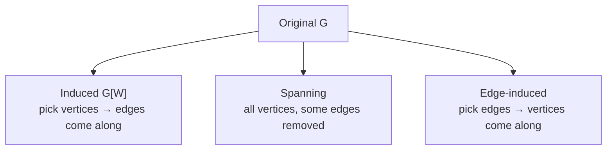

---
tags:
  - bil403
  - graph-theory
  - definition
---

# Subgraphs

Related: [[Graph Operations]] · [[Graph — Basic Definitions]] · [[Graph Theory MOC]]

> [!note] Definition — Subgraph
> A **subgraph** of a graph $G = (V, E)$ is a graph $H = (W, F)$ with $W \subseteq V$ and $F \subseteq E$.
> $H$ is a **proper subgraph** of $G$ if $H \neq G$; written $H \subset G$.

> [!note] Definition — Induced subgraph
> Let $G = (V, E)$ be a simple graph. The subgraph **induced** by a subset $W \subseteq V$ is the graph $(W, F)$ where $F$ contains **all edges of $E$ whose both endpoints are in $W$**.
>
> *That is: pick vertices, automatically take all original edges among them.* Notation: $G[W]$.

> [!note] Definition — Spanning subgraph
> If the subgraph's vertex set equals the original, i.e. $V(H) = V(G)$, then $H$ is a **spanning subgraph**.
>
> *That is: keep all vertices, drop some edges.*

> [!note] Definition — Edge-induced subgraph
> An edge set is chosen; the subgraph's vertices are exactly the endpoints of those edges.

## The three at a glance



> [!example] Example (from lecture)
> On $K_5$:
> - The subgraph **induced** by $W = \{a,b,c,e\}$ → those 4 vertices and *all* $K_5$ edges among them.
> - If a subgraph $G_3$ satisfies $V(G_3) = V(G)$, it is a **spanning** subgraph.
> - $G_2$ and $G_5$ are subgraphs **induced** by $\{v,x,y,z\}$ and $\{u,v,y,z\}$ respectively; $G_4$ is an **edge-induced** subgraph.

> [!tip] Exam tip
> With an "induced" subgraph you **cannot choose edges** — the vertex set fully determines the edges. With a spanning subgraph you **choose edges**, with the vertex set fixed.

---
> [!tip]- Code (NetworkX)
> ```python
> H = G.subgraph(['a','b','c','e'])             # induced subgraph G[W]
> H = G.edge_subgraph([('a','b'),('b','c')])    # edge-induced
> # spanning subgraph: copy all vertices, remove edges
> S = nx.Graph(); S.add_nodes_from(G); S.add_edges_from(chosen_edges)
> ```
